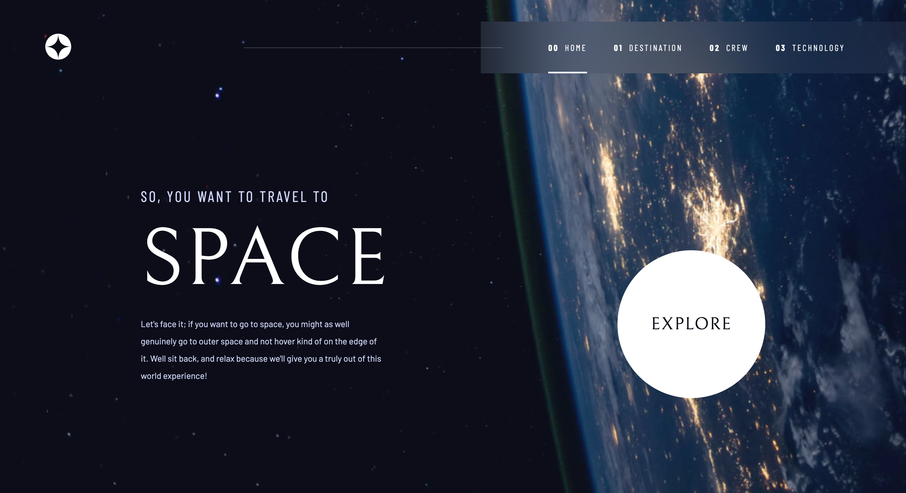

# Frontend Mentor - Space tourism website solution

This is a solution to the [Space tourism website challenge on Frontend Mentor](https://www.frontendmentor.io/challenges/space-tourism-multipage-website-gRWj1URZ3). Frontend Mentor challenges help you improve your coding skills by building realistic projects.

### The challenge

Users should be able to:

- View the optimal layout for each of the website's pages depending on their device's screen size
- See hover states for all interactive elements on the page
- View each page and be able to toggle between the tabs to see new information

### Screenshot

### Links

- Live Site URL: [https://stetu281.github.io/space/index.html](https://stetu281.github.io/space/index.html)

## My process

### Built with

- HTML
- SCSS
- Flexbox
- CSS Grid
- Mobile-first workflow
- Webpack 5

## Author

- Website - [Stefan Turner](https://www.stefanturner.ch)
- Frontend Mentor - [@stetu281](https://www.frontendmentor.io/profile/stetu281)
